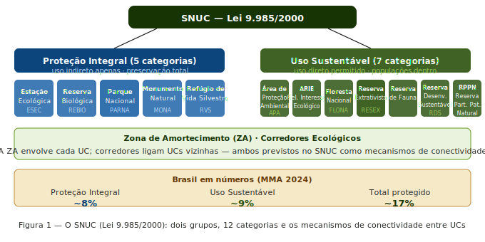
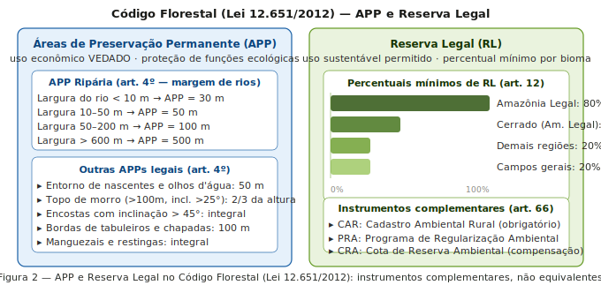
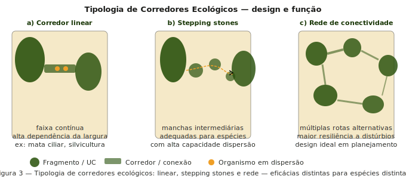
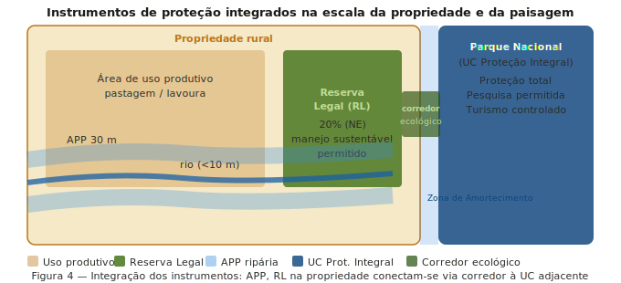
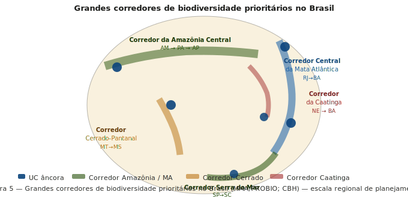
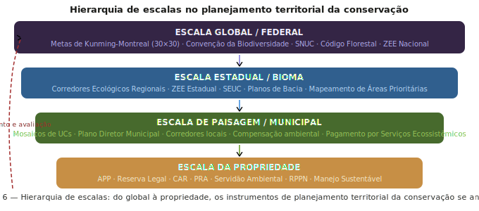

# Apresentação da aula {.unnumbered}

::: {.callout-note appearance="minimal"}
Use as setas ← → para navegar pelos slides. Pressione `F` para tela cheia e `?` para ver todos os atalhos.
:::

```{=html}
<iframe
  src="/slides/week13_slides.html"
  width="100%"
  height="500px"
  style="border: 1px solid #ddd; border-radius: 8px; margin-bottom: 2rem;"
  allowfullscreen>
</iframe>
```

---

# Introdução {#sec-intro}

A Ecologia de Paisagens não existe no vácuo — ela opera em um contexto institucional e legal que determina, em grande medida, quais intervenções são possíveis, quais áreas podem ser protegidas e com quais instrumentos. Nesta semana, conectamos os conceitos ecológicos das semanas anteriores com os instrumentos jurídicos e de planejamento que materializam a conservação no território brasileiro.

Três pilares estruturam esta aula:

- **O SNUC** — o arcabouço legal que organiza as Unidades de Conservação no Brasil
- **O Código Florestal** — que regula o uso da terra em propriedades privadas via APP e Reserva Legal
- **Os corredores de biodiversidade** — a dimensão de conectividade do planejamento territorial

A Semana 12 mostrou que paisagens são construções sociais atravessadas por relações de poder. Esta semana mostra que elas são também construções *legais* — e que compreender os instrumentos jurídicos é tão essencial para o ecólogo de paisagens quanto compreender as métricas de fragmentação.

::: {.callout-note}
## Conexão com as semanas anteriores
Os conceitos de conectividade (semana 6), metapopulações (semana 7) e fluxos biogeoquímicos (semana 8) têm expressões diretas nos instrumentos desta semana: corredores ecológicos operacionalizam conectividade; UCs de proteção integral criam patches de habitat de alta qualidade que ancoram dinâmicas metapopulacionais; zonas de amortecimento regulam os fluxos de nutrientes e espécies entre as UCs e a matriz.
:::

---

# O Sistema Nacional de Unidades de Conservação (SNUC) {#sec-snuc}

## A lei e sua estrutura

O SNUC (Lei 9.985/2000) institui o Sistema Nacional de Unidades de Conservação da Natureza e estabelece critérios e normas para a criação, implantação e gestão das unidades de conservação. É o principal instrumento de proteção formal da biodiversidade brasileira.

O SNUC agrupa as unidades de conservação em dois grupos, de acordo com suas características e seus objetivos: Proteção Integral e Uso Sustentável. As UCs de uso sustentável têm como objetivo equilibrar a preservação da área juntamente com o uso sustentável dos seus recursos, colocando em harmonia a preservação da biodiversidade com a presença da população local. Já as UCs de uso integral têm como objetivo a preservação total da área, não sendo permitida a utilização de seus recursos diretos, porém são permitidas atividades que não envolvam consumo, coleta ou dano, como pesquisas científicas, educação e interpretação ambiental.

{width="100%"}

## Proteção Integral: as cinco categorias

O grupo das Unidades de Proteção Integral é composto por Estação Ecológica, Reserva Biológica, Parque Nacional, Monumento Natural e Refúgio de Vida Silvestre.

- **ESEC — Estação Ecológica**: objetivos de pesquisa científica e proteção da natureza; acesso restrito; permite alterações mínimas para recuperação de ecossistemas
- **REBIO — Reserva Biológica**: preservação integral da biota; sem interferência humana direta, exceto medidas de recuperação; não há visitação pública
- **PARNA — Parque Nacional**: preservação de ecossistemas de relevância ecológica e beleza cênica; pesquisa, educação ambiental e turismo ecológico permitidos; a categoria mais popular e com maior área total no Brasil
- **MONA — Monumento Natural**: preservação de sítios naturais raros, singulares ou de grande beleza cênica; pode ser criado em propriedade privada
- **RVS — Refúgio de Vida Silvestre**: proteção de ambientes para espécies ou comunidades da biota local; pode ter propriedades privadas dentro de seus limites

## Uso Sustentável: as sete categorias

O grupo das unidades de uso sustentável é composto por sete categorias de unidades de conservação: a área de proteção ambiental, a área de relevante interesse ecológico, a floresta nacional, a reserva extrativista, a reserva de fauna, a reserva de desenvolvimento sustentável e a reserva particular do patrimônio natural.

- **APA**: área em geral extensa, com certo grau de ocupação humana; disciplina o processo de ocupação; proprietários privados mantêm seus imóveis
- **ARIE**: menor extensão; atributos bióticos e abióticos de importância regional; pouca ou nenhuma ocupação humana
- **FLONA**: cobertura florestal predominantemente nativa; uso múltiplo sustentável de recursos florestais; pesquisa; populações tradicionais residentes antes da criação
- **RESEX**: uso sustentável por populações extrativistas tradicionais; domínio público com uso concedido; gestão compartilhada com a comunidade
- **RDS**: populações tradicionais com sistema sustentável de exploração dos recursos naturais; domínio público
- **RPPN**: área privada, gravada com perpetuidade; iniciativa do proprietário; manejo apenas para pesquisa e turismo ecológico

## Zona de Amortecimento e Corredores Ecológicos

O SNUC prevê dois instrumentos de conectividade territorial fundamentais:

**Zona de Amortecimento (ZA)**: entorno de cada UC onde as atividades humanas estão sujeitas a normas específicas para minimizar os impactos negativos sobre a unidade. A ZA opera como uma zona de transição gradual entre o interior da UC e a matriz da paisagem — cumprindo a função de reduzir o efeito de borda estudado na semana anterior.

**Corredores Ecológicos**: porções de ecossistemas naturais ou seminaturais ligando UCs que possibilitam entre elas o fluxo de genes e o movimento da biota. São a operacionalização legal do conceito ecológico de conectividade funcional — a ponte entre a teoria metapopulacional (semana 7) e a política de conservação.

---

# O Código Florestal (Lei 12.651/2012) {#sec-cf}

## Os dois instrumentos principais

O Código Florestal regula o uso da vegetação nativa em **propriedades privadas rurais**. Seus dois instrumentos principais são complementares e ecologicamente distintos:

{width="100%"}

## Áreas de Preservação Permanente (APP)

As Áreas de Preservação Permanente (APPs) são áreas cobertas, ou não, por vegetação nativa, protegidas da ação humana devido à sua grande importância natural. Elas têm por objetivo preservar os recursos hídricos, a paisagem, a estabilidade geológica e a biodiversidade local. Por isso, não é permitido construir, cultivar ou explorar estas áreas, nem mesmo por meio de um manejo florestal sustentável.

As APPs são definidas por localização — não por percentual de área. Elas protegem:

- **Margens de rios**: faixas que variam de 30 m (rios < 10 m de largura) a 500 m (rios > 600 m)
- **Entornos de nascentes e olhos d'água perenes**: raio mínimo de 50 m
- **Topos de morro**: acima da curva de nível correspondente a 2/3 da altura, em morros com altura mínima de 100 m e inclinação média > 25°
- **Encostas com inclinação > 45°**: proteção integral
- **Manguezais e restingas**: proteção integral em toda sua extensão

Ecologicamente, as APPs são os elementos da paisagem que protegem os recursos hídricos, regulam os fluxos de nutrientes (como vimos na semana 8) e criam a estrutura de corredores ripários que conectam fragmentos na escala da bacia hidrográfica.

## Reserva Legal (RL)

A Reserva Legal é uma porcentagem de uma propriedade rural que deve ter a sua cobertura de vegetação nativa preservada. Nela, é permitida a exploração dos recursos naturais de forma sustentável e ecologicamente responsável. O percentual mínimo de cada propriedade que deve ser destinado para este fim varia de acordo com o bioma em que ela está localizada. Em áreas de floresta da Amazônia Legal, a Reserva Legal deve corresponder a 80% da área da propriedade. Nas demais regiões do Brasil, este número é inferior. No cerrado, a porcentagem mínima é de 35%. Nos campos gerais e demais regiões do país, 20% do imóvel rural deve corresponder à RL.

Diferentemente da APP, a RL é definida por **percentual de área** e permite o manejo sustentável. A localização da RL no imóvel rural deve considerar: plano de bacia hidrográfica; Zoneamento Ecológico-Econômico; formação de corredores ecológicos (com outras RL, APP, UC, etc.); áreas de maior importância para conservação da biodiversidade; e áreas de maior fragilidade ambiental. Esse critério de localização é uma oportunidade ecológica subutilizada: quando as RLs de propriedades adjacentes são posicionadas de forma contígua, formam corredores de habitat privado que ampliam significativamente a conectividade da paisagem.

## O CAR e o PRA

O CAR é um banco de dados inovador que armazena e processa informações georreferenciadas de APP, Reserva Legal, remanescentes de vegetação nativa, áreas com atividades econômicas ou degradadas. É um cadastro obrigatório e autodeclaratório, e suas informações compõem um banco de dados que serve para controle, monitoramento, planejamento e gestão ambiental.

O CAR é hoje um dos maiores bancos de dados de uso da terra do mundo — com declarações que cobrem a quase totalidade das propriedades rurais brasileiras. Para a Ecologia de Paisagens, ele é uma fonte valiosa de dados para análise da distribuição de APPs e RLs em escala nacional.

::: {.callout-warning}
## O problema do passivo ambiental
Em 2025, a Lei de Proteção da Vegetação Nativa (Lei nº 12.651/2012), conhecida simplesmente por Código Florestal, completa 13 anos de sua promulgação. Apesar disso, o Código Florestal é uma política fundamental para o país combater as mudanças climáticas, proteger a sua biodiversidade e garantir a segurança alimentar e o desenvolvimento rural. O passivo de APPs e RLs degradadas ainda é enorme — e a eficácia do PRA (Programa de Regularização Ambiental) como instrumento de recuperação é amplamente debatida.
:::

---

# Corredores Ecológicos: da teoria ao planejamento {#sec-corredores}

## Tipologia de corredores

Na semana 6, estudamos a conectividade funcional como propriedade emergente da interação entre a estrutura da paisagem e a biologia dos organismos. Corredores ecológicos são a tradução dessa propriedade em instrumento de planejamento territorial. Não existe um único tipo de corredor — a eficácia de cada tipo depende criticamente da espécie ou processo em questão.

{width="100%"}

**Corredor linear**: faixa contínua de habitat conectando dois ou mais fragmentos. É o tipo mais intuitivo e o mais implementado. Sua eficácia depende principalmente da largura — corredores estreitos (< 100 m) são funcionais para pequenos mamíferos e aves generalistas, mas insuficientes para espécies especialistas de interior florestal ou mamíferos de médio e grande porte. Os corredores ripários do Código Florestal (APPs de margem) são corredores lineares — mas sua largura mínima (30 m) frequentemente é inadequada para espécies exigentes.

**Stepping stones**: manchas de habitat intermediárias que, embora não formem continuidade, permitem o movimento de espécies com alta capacidade de dispersão. São especialmente eficazes para aves frugívoras e morcegos que cruzam a matriz em voos curtos. Têm custo de implementação muito menor que corredores lineares e podem ser criadas via RPPNs ou averbação de RLs em posições estratégicas.

**Rede de conectividade**: múltiplas rotas alternativas entre fragmentos, formando um grafo complexo. É o design mais resiliente a distúrbios — se uma rota é bloqueada (queimada, colhida, secada), o fluxo pode continuar por rotas alternativas. É o ideal teórico do planejamento de conservação sistemático, mas exige análise espacial sofisticada para identificar os nós e arestas prioritários.

## A integração na escala da propriedade e da paisagem

O potencial mais subutilizado do Código Florestal é o critério de **localização contígua das Reservas Legais**. Se as RLs de propriedades vizinhas forem posicionadas de forma adjacente, o resultado é um corredor de habitat privado sem custo adicional para o Estado — apenas uma decisão de posicionamento dentro do imóvel.

{width="100%"}

## Os grandes corredores de biodiversidade do Brasil

Na escala regional, o Brasil tem um conjunto de grandes iniciativas de conectividade que articulam múltiplas UCs, RLs, APPs e propriedades em corredores de centenas de quilômetros:

{width="100%"}

**Corredor Central da Mata Atlântica**: liga remanescentes do sul da Bahia ao Espírito Santo e Rio de Janeiro, passando por uma das regiões de maior biodiversidade do planeta. Âncoras incluem o Parque Nacional do Descobrimento, a Reserva Biológica de Una e o PARNA da Serra dos Órgãos.

**Corredor da Serra do Mar**: conecta fragmentos de Mata Atlântica ao longo da Serra do Mar, do litoral paulista até Santa Catarina. Um dos corredores mais estudados em termos de eficácia para fauna.

**Corredor Cerrado-Pantanal**: articulação entre remanescentes de Cerrado no Centro-Oeste com a planície pantaneira — fundamental para espécies como o lobo-guará, o cervo-do-pantanal e a ariranha.

**Corredor Amazônia Central**: faixa que articula grandes blocos de floresta no Amazonas e Pará, incluindo o mosaico de UCs do Baixo Rio Negro.

---

# Planejamento territorial multi-escala {#sec-escalas}

Uma das contribuições mais importantes da Ecologia de Paisagens ao planejamento da conservação é a perspectiva multi-escala: diferentes instrumentos operam em diferentes escalas, e a conservação efetiva exige coerência entre todas elas.

{width="100%"}

**Escala global/federal**: as Metas de Kunming-Montreal (2022) estabelecem o objetivo de proteger 30% da superfície terrestre até 2030 (meta 30×30). O Brasil, com seus ~17% atualmente protegidos, terá que mais que dobrar a área protegida para atingir essa meta — o que requerirá tanto a criação de novas UCs quanto a incorporação de outros instrumentos (RLs privadas, Terras Indígenas, territórios quilombolas) ao portfólio de proteção.

**Escala estadual/bioma**: o Zoneamento Ecológico-Econômico (ZEE) e os planos estaduais de biodiversidade operam nessa escala, identificando áreas prioritárias, definindo corredores regionais e estabelecendo restrições ao uso do solo em áreas críticas.

**Escala da paisagem/municipal**: mosaicos de UCs, planos diretores municipais e compensações ambientais de licenciamento operam nessa escala — a mais diretamente ligada às métricas de paisagem que calculamos no `landscapemetrics`.

**Escala da propriedade**: APP, RL, CAR e as ferramentas de regularização ambiental operam no nível individual da propriedade — mas seus efeitos agregados moldam a paisagem em escalas muito maiores.

::: {.callout-tip}
## Planejamento Sistemático da Conservação
A abordagem metodológica que integra todas essas escalas é o **Planejamento Sistemático da Conservação** (Margules & Pressey 2000), que usa algoritmos de otimização espacial (como o Zonation ou o Marxan) para identificar o conjunto mínimo de áreas que atinge as metas de representação de biodiversidade com o menor custo econômico e social. Esta é a ponte entre a Ecologia de Paisagens e a tomada de decisão sobre áreas protegidas.
:::

---

# Síntese {#sec-sintese}

O planejamento territorial da conservação no Brasil opera por meio de três instrumentos principais — SNUC, Código Florestal e corredores ecológicos — que atuam em escalas complementares e precisam ser integrados para que a conservação seja efetiva. Cinco lições emergem:

**1. UCs e propriedades privadas são complementares, não rivais.** A proteção formal das UCs é necessária mas insuficiente — grande parte da biodiversidade brasileira está fora das UCs, em propriedades privadas reguladas pelo Código Florestal. APP e RL são o instrumento de conservação com maior área coberta no Brasil.

**2. Corredores operacionalizam conectividade.** Os conceitos ecológicos das semanas 6 e 7 se traduzem diretamente em instrumentos legais: zonas de amortecimento reduzem o efeito de borda; corredores ecológicos sustentam dinâmicas metapopulacionais; a localização contígua das RLs cria redes de habitat privado.

**3. A escala importa.** Nenhum instrumento isolado é suficiente. A efetividade da conservação depende da coerência entre a escala global (metas internacionais), estadual (ZEE, UCs), de paisagem (mosaicos, corredores regionais) e da propriedade (APP, RL).

**4. O Código Florestal tem potencial de conectividade subutilizado.** O critério legal de localizar as RLs de forma a favorecer corredores ecológicos (art. 14) raramente é aplicado com rigor ecológico. Quando aplicado, cria conectividade privada sem custo público.

**5. 30×30 exige criatividade institucional.** Para atingir as Metas de Kunming-Montreal, o Brasil precisará reconhecer Terras Indígenas, territórios quilombolas, RPPNs e áreas de manejo comunitário como contribuições para as metas globais — articulando justiça territorial (semana 12) com planejamento conservacionista.

---

# Leituras recomendadas {#sec-leituras}

| Referência | Por que ler |
|---|---|
| Lei 9.985/2000 — SNUC | Texto legal fundacional: categorias, ZA, corredores |
| Lei 12.651/2012 — Código Florestal | Texto da lei: APP, RL, CAR, PRA |
| Margules & Pressey (2000) *Nature* 405:243–253 | Planejamento sistemático da conservação — o artigo fundador |
| Metzger (2010) *Biota Neotropica* 10(1) | Ecologia de Paisagens e o Código Florestal: análise crítica |
| Soares-Filho et al. (2014) *Science* 344:363–364 | Impacto da revisão do Código Florestal de 2012 sobre APPs e RL |
| CPI (2025) *Monitor do Código Florestal* | Situação atual da implementação — leitura essencial |
| Rambaldi & Oliveira (2003) *Fragmentação de Ecossistemas* | Corredores ecológicos no Brasil — referência clássica |

---

# Atividade prática {#sec-atividade}

::: {.callout-important}
## Atividade da Semana 13 — para treinar

Usando o raster de uso do solo do MapBiomas do seu município de Pernambuco (obtido no tutorial da Semana 9):

1. **Identifique as APPs ripárias**: use o raster de drenagem (disponível no IBGE ou ANA) para criar buffers de 30 m ao longo dos rios com largura < 10 m e verifique qual fração dessas APPs ainda tem cobertura de vegetação nativa segundo o MapBiomas.

2. **Simule a localização ótima da Reserva Legal**: para uma propriedade hipotética de 200 ha no seu município (20% = 40 ha de RL obrigatória), use o critério do art. 14 do Código Florestal para propor a localização que maximize a conectividade com remanescentes vizinhos. Calcule as métricas de conectividade estrutural antes e depois da inclusão da RL.

3. **Avalie o potencial de corredor**: identifique o par de fragmentos de vegetação nativa mais próximos no seu município que não estão conectados. Proponha um traçado de corredor (linear ou stepping stones) e calcule quantos hectares de restauração seriam necessários.

4. **Discuta**: considerando os conceitos das semanas 12 e 13, que atores precisariam ser envolvidos para que o corredor proposto fosse implementado? Que instrumentos legais (SNUC, Código Florestal, PSE) poderiam viabilizá-lo?

:::

---

*Semana 13 — Ecologia de Paisagens BO-304, UFPE, 2026.1. Material em desenvolvimento contínuo.*
