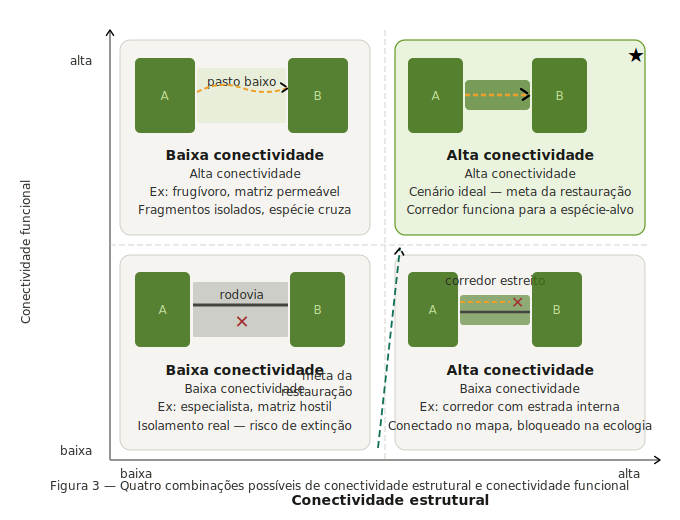

## Slides desta aula

Tela cheia [CLIQUE AQUI](https://fplmelo.github.io/ecologia_paisagem/slides/slides_semana6.html#/title-slide) e depois pressione 'f'

<iframe class="slide-deck" src="https://fplmelo.github.io/ecologia_paisagem/slides/slides_semana6.html#/title-slide" width="700px" height="500px"></iframe>

# Introdução {#sec-intro}

Imagine dois fragmentos de Mata Atlântica separados por uma estreita faixa de vegetação ciliar. Pelo mapa de satélite, os três polígonos se tocam — estão fisicamente unidos. Mas uma onça-parda (*Panthera onca*) consegue usá-los como um único território contínuo? E um besouro especialista em interior de floresta? E um fungo que só se dispersa por vento dentro do dossel?

A resposta, invariavelmente, será: **depende da espécie**. E é exatamente essa dependência que separa dois conceitos fundamentais da Ecologia de Paisagens que frequentemente são confundidos na literatura e, mais ainda, no planejamento conservacionista:

- **Conexidade** (*connectedness* ou *contiguity*): uma propriedade **estrutural** da paisagem
- **Conectividade** (*connectivity*): uma propriedade **funcional** da paisagem, que envolve organismo e estrutura simultaneamente

Compreender a diferença entre eles não é apenas exercício teórico. É a base para decidir **onde intervir**, **para quem** e **como** em qualquer esforço de conservação ou restauração de paisagens.

---

# Conectividade (Conexidade) Física: a geometria da paisagem {#sec-conexidade}

## Definição

A **conexidade física** (também chamada de *conectividade estrutural*) descreve o grau em que os elementos da paisagem estão **fisicamente contíguos ou próximos** no espaço, independentemente de qualquer processo ecológico. É uma propriedade mensurável a partir de um mapa, uma imagem classificada ou um modelo digital de ocupação do solo — **sem necessidade de qualquer dado biológico**.

Em termos operacionais, dois fragmentos são estruturalmente conectados quando:

1. Compartilham uma borda comum (adjacência direta), ou
2. Estão dentro de um limiar de distância previamente definido (proximidade).

::: {.callout-note}
## Conectividade Estrutural


Mapa de uso do solo binário (habitat / não-habitat) com fragmentos numerados, mostrando pares de fragmentos conectados por borda comum vs. pares separados por distância variável. Idealmente, um par de mapas: um com conexidade alta (manchas que se tocam) e outro com conexidade baixa (manchas dispersas). Fonte sugerida: imagem classificada de paisagem do Nordeste ou da Mata Atlântica.
:::

## O que a conexidade mede — e o que ela não mede

A conexidade responde perguntas como:

- Qual a proporção da paisagem formada por habitat contíguo?
- Quantos fragmentos estão a menos de 500 m de outro fragmento?
- Qual o maior bloco contínuo de vegetação nativa nesta paisagem?

Para medi-la, usamos métricas como o **Índice de Contiguidade** (*CONTIG*), a **distância ao vizinho mais próximo** (*ENN — Euclidean Nearest Neighbor Distance*) e o índice de **proximidade** (*PROX*), todos disponíveis no pacote `landscapemetrics`.

O que ela **não mede**: se um organismo real consegue de fato se mover entre os fragmentos, se a matriz entre eles oferece resistência maior ou menor para diferentes espécies, ou se o corredor que os conecta fisicamente é funcional para a espécie de interesse.

## Exemplo: o corredor que existe no mapa mas não na ecologia

Considere uma faixa de vegetação ciliar de 30 m de largura ligando dois fragmentos de Caatinga. Do ponto de vista da conexidade física, os fragmentos estão conectados — há continuidade espacial de habitat nativo. Do ponto de vista ecológico:

- Para um **sagui-de-tufos-brancos** (*Callithrix jacchus*), generalista e tolerante a bordas, este corredor pode ser perfeitamente funcional.
- Para um **gavião-real** (*Harpia harpyja*), que necessita de extensas áreas de floresta contínua para caça e nidificação, esse corredor de 30 m é um obstáculo ecológico, não uma passagem.
- Para **sementes dispersas por vento** (*anemocoria*), a faixa pode ser suficiente para garantir fluxo gênico entre as populações.

A conexidade é a mesma para todos. A conectividade ecológica é radicalmente diferente.

::: {.callout-tip}
## Ponto de reflexão
Antes de propor ou avaliar um corredor ecológico, a pergunta correta não é *"existe conexão física entre os fragmentos?"*, mas sim *"esta conexão física é ecologicamente funcional para a espécie ou processo que queremos conservar?"*
:::

---

# Conectividade Ecológica: organismo e paisagem em interação {#sec-conectividade}

## Definição

A **conectividade ecológica** — ou **conectividade funcional** — descreve o grau em que uma paisagem facilita ou impede o **movimento de organismos** (e, por extensão, o **fluxo de genes, propágulos, energia e matéria**) entre os elementos do mosaico. Ela é, portanto, uma propriedade **emergente da interação entre a estrutura da paisagem e as características biológicas dos organismos**.

A definição clássica, atribuída a Taylor et al. (1993), estabelece que a conectividade da paisagem é *"o grau no qual a paisagem facilita ou impede o movimento entre manchas de recurso"*. Essa formulação é deliberadamente organismo-centrada: a mesma paisagem pode ser altamente conectada para uma espécie e completamente isolante para outra.

Já Tischendorf & Fahrig (2000) propuseram que a conectividade só pode ser medida de forma completa quando se considera explicitamente o comportamento de movimento dos organismos — sua taxa de dispersão, capacidade de cruzar habitats hostis, e a mortalidade diferencial em diferentes tipos de matriz.

## Componentes da conectividade ecológica

A conectividade funcional de uma paisagem para uma espécie depende de três componentes principais:

**1. Percolação do habitat**
É a capacidade do habitat de formar redes contínuas ou quase-contínuas que os organismos possam percorrer. Deriva da teoria da percolação: existe um limiar crítico de cobertura de habitat (~59% em paisagens homogêneas) abaixo do qual a probabilidade de haver uma rota contínua entre quaisquer dois pontos da paisagem colapsa abruptamente.

**2. Densidade de corredores e *stepping stones***
Corredores são elementos lineares da paisagem que ligam fragmentos anteriormente separados. *Stepping stones* são pequenas manchas de habitat que, embora não formem conexão contínua, funcionam como pontos de parada ou refúgio temporário para organismos em dispersão. Ambos aumentam a conectividade funcional sem necessariamente alterar a conexidade estrutural de forma drástica.

**3. Permeabilidade da matriz**
A matriz — o elemento dominante e de não-habitat na paisagem — raramente é impenetrável. Diferentes tipos de matriz oferecem diferentes níveis de resistência ao movimento dos organismos. Uma matriz de pasto baixo é muito mais permeável para mamíferos de médio porte do que uma matriz de cana-de-açúcar densa. Uma rodovia de alta velocidade pode ser a barreira mais intransponível dentro de uma paisagem visualmente bem coberta.

::: {.callout-note}
## componentes da conectividade funcional


Diagrama conceitual dos três componentes da conectividade funcional: (a) percolação — paisagem com habitat acima e abaixo do limiar crítico, mostrando a ruptura da rede; (b) corredores e *stepping stones* — fragmentos ligados por corredor linear vs. por stepping stones; (c) permeabilidade da matriz — mesmo par de fragmentos, com matrizes de resistência diferente e trajetórias de movimento simuladas. Referência visual: figuras 2 e 3 de Metzger (2001, Biota Neotropica).
:::

## Conectividade é espécie-específica e escala-dependente

Dois aspectos tornam a conectividade ecológica intrinsecamente mais complexa de medir do que a conexidade física:

**Espécie-especificidade**: A paisagem não existe de forma única e objetiva — ela existe através dos olhos (e das patas, e das asas) de cada espécie. A *escala de percepção* de cada organismo — determinada pelo seu tamanho de território, capacidade de locomoção e especificidade de habitat — define o que é habitat, o que é matriz e o que é barreira. Para um anfíbio, um ramal de estrada não pavimentado pode ser uma barreira intransponível. Para uma garça, é invisível.

**Dependência de escala**: A mesma paisagem pode parecer altamente conectada quando observada em escala de 1 km², e completamente fragmentada quando observada em escala de 100 km². Metzger (2001) enfatiza que tanto a *extensão espacial* quanto o *grão* da análise precisam ser calibrados para a espécie ou processo em questão.

---

# Confrontando os dois conceitos {#sec-comparacao}

A tabela abaixo sintetiza as diferenças fundamentais entre os dois conceitos:

| Atributo | Conexidade Física | Conectividade Ecológica |
|---|---|---|
| **Natureza** | Estrutural | Funcional |
| **Medida a partir de** | Mapa / imagem classificada | Dados biológicos + estrutura da paisagem |
| **Depende da espécie?** | Não | Sim, fortemente |
| **Depende da escala?** | Parcialmente | Sim, fortemente |
| **Métricas típicas** | ENN, CONTIG, PROX, % habitat contíguo | Resistência da matriz, modelos de circuito, telemetria, genética da paisagem |
| **Pode ser medida só com SIG?** | Sim | Não completamente |
| **Ferramentas de análise** | `landscapemetrics`, FRAGSTATS | Circuitscape, Conefor, `gdistance` |
| **Pergunta que responde** | "Os fragmentos estão próximos/ligados?" | "Os organismos conseguem se mover entre os fragmentos?" |

::: {.callout-note}
## Entendendo as conectividades



Figura clássica de quatro painéis mostrando as quatro combinações possíveis: (A) alta conexidade + alta conectividade; (B) alta conexidade + baixa conectividade (ex: corredor fisicamente presente mas com alta mortalidade); (C) baixa conexidade + alta conectividade (ex: fragmentos isolados mas com matriz permeável para a espécie); (D) baixa conexidade + baixa conectividade. Cada painel com uma paisagem esquemática e uma trajetória de movimento de organismo.
:::

---

# Implicações práticas e exemplos {#sec-exemplos}

## Caso 1: Corredor físico, barreira ecológica — a Caatinga fragmentada

O Nordeste brasileiro apresenta um dos maiores déficits de conectividade da América do Sul. Em paisagens dominadas por agricultura e pecuária na Caatinga, é comum encontrar fragmentos ligados por mata ciliar. Estruturalmente, esses fragmentos têm conexidade mensurável — o mapa mostra continuidade.

Contudo, para **mamíferos de médio e grande porte** — onças, lobos-guará, tamanduás — que dependem de territórios extensos e são altamente sensíveis à presença humana, essas faixas ciliares de 30–50 m funcionam como gargalos (*bottlenecks*) de alta mortalidade, e não como corredores. A mortalidade por atropelamento nas estradas que cortam essas faixas frequentemente é o fator mais determinante da conectividade funcional — independente da largura do corredor no mapa.

## Caso 2: Fragmentos isolados, mas funcionalmente conectados — dispersão por aves

Em paisagens de Mata Atlântica do interior paulista, Antongiovanni & Metzger (2005) mostraram que certas espécies de aves insetívoras de sub-bosque são incapazes de cruzar mesmo 30–50 m de matriz aberta. Para essas espécies, a paisagem é funcionalmente fragmentada muito antes de ser estruturalmente descontínua.

Por outro lado, espécies frugívoras que dispersam sementes — como tucanos e sabiás — facilmente cruzam centenas de metros de matriz agrícola, criando conectividade funcional para regeneração vegetal mesmo em paisagens com conexidade estrutural muito baixa. A mesma paisagem, para os mesmos fragmentos, gera dois diagnósticos opostos de conectividade.

## Caso 3: *Stepping stones* e o mico-leão-dourado

O mico-leão-dourado (*Leontopithecus rosalia*), espécie criticamente ameaçada endêmica da Mata Atlântica do estado do Rio de Janeiro, vive em uma paisagem altamente fragmentada. Estudos de telemetria e genética de paisagem mostraram que a espécie é capaz de cruzar pequenas lacunas de matriz se houver *stepping stones* adequadas — pequenas manchas de vegetação que funcionam como paradas de descanso e alimentação.

Crucialmente, estradas de alta velocidade reduziram o relacionamento genético entre indivíduos mesmo quando a paisagem apresentava conexidade estrutural razoável. A barreira funcional de uma rodovia supera a conexidade física da vegetação que a margeia.

::: {.callout-note}
## Mico-leão na paisagem


Mapa da área de distribuição do mico-leão-dourado no estado do Rio de Janeiro, mostrando fragmentos de habitat, estradas e simulações de corredores com e sem stepping stones. Referência: Kierulff et al. ou Ribeiro et al. A figura ilustra como a conectividade funcional modelada diverge da conexidade estrutural.
:::

---

# Medindo conectividade no R {#sec-r}

## Conexidade com `landscapemetrics`

As métricas estruturais podem ser calculadas diretamente a partir de rasters categóricos:

```{r}
library(terra)
library(landscapemetrics)
library(ggplot2)
library(dplyr)

# Paisagem de exemplo do pacote
paisagem <- terra::rast(landscapemetrics::landscape)

# ----- MÉTRICAS DE CONEXIDADE / PROXIMIDADE ESTRUTURAL -----

# 1. Distância ao vizinho mais próximo (por fragmento)
enn <- lsm_p_enn(paisagem)

# 2. Número de fragmentos por classe
np <- lsm_c_np(paisagem)

# . Área total de habitat por classe
ca <- lsm_c_ca(paisagem)

# Organizar e visualizar ENN por classe
enn_plot <- enn |>
  mutate(class = factor(class, labels = c("Classe 1", "Classe 2", "Classe 3")))

ggplot(enn_plot, aes(x = class, y = value, fill = class)) +
  geom_boxplot(alpha = 0.7, outlier.shape = 21) +
  scale_fill_manual(values = c("darkgreen", "orange", "steelblue")) +
  labs(
    title    = "Distância ao Vizinho Mais Próximo por Classe",
    subtitle = "Métrica estrutural de isolamento — ENN (m)",
    x        = "Classe de habitat",
    y        = "ENN (unidades do mapa)",
    caption  = "Fonte: landscapemetrics::landscape"
  ) +
  theme_classic(base_size = 13) +
  theme(legend.position = "none")
```

## Permeabilidade da matriz com `gdistance`

A conectividade funcional exige um modelo de **resistência da matriz** — onde cada célula do raster recebe um valor de custo ao movimento. O pacote `gdistance` permite calcular distâncias de custo mínimo entre fragmentos:

```{r}
#| eval: false

# Instale se necessário: install.packages("gdistance")
library(gdistance)
library(terra)

# Criar raster de resistência (exemplo simplificado)
# Valores maiores = maior resistência ao movimento
paisagem <- terra::rast(landscapemetrics::landscape)

# Definir resistência por classe de uso
resistencia <- classify(paisagem, 
  rcl = matrix(c(
    1, 1,    # floresta: baixa resistência
    2, 10,   # pastagem: resistência moderada
    3, 100   # agricultura: alta resistência
  ), ncol = 2, byrow = TRUE))

# Converter para o formato raster do gdistance
r_raster <- raster::raster(resistencia)

# Criar grafo de transição (4 ou 8 direções)
trans <- gdistance::transition(r_raster, 
                                transitionFunction = mean, 
                                directions = 8)
trans_corr <- gdistance::geoCorrection(trans)

# Distância de custo mínimo entre dois pontos
ponto_A <- c(10, 10)
ponto_B <- c(40, 40)

distancia_custo <- gdistance::costDistance(trans_corr,
  sp::SpatialPoints(matrix(ponto_A, 1, 2)),
  sp::SpatialPoints(matrix(ponto_B, 1, 2)))

cat("Distância euclidiana:", round(sqrt(sum((ponto_B - ponto_A)^2)), 1), "\n")
cat("Distância de custo:  ", round(as.numeric(distancia_custo), 1), "\n")
```

::: {.callout-tip}
## Circuitscape: a abordagem de teoria de circuitos

Para análises mais sofisticadas de conectividade funcional, a ferramenta **Circuitscape** (McRae et al. 2008) usa analogia com circuitos elétricos para modelar o fluxo de organismos através da paisagem. Em vez de encontrar apenas o caminho de menor custo, ela estima a probabilidade de passagem por cada célula — capturando toda a diversidade de rotas possíveis. O pacote `Circuitscape.jl` tem integração com R via `julia_call`. Veremos isso na Semana 10.
:::

---

# Síntese conceitual {#sec-sintese}

A distinção entre conexidade física e conectividade ecológica pode ser resumida em uma frase: **a primeira pertence ao mapa; a segunda pertence à espécie**.

Isso tem consequências diretas para a prática conservacionista:

**1. Um diagnóstico de fragmentação baseado apenas em métricas estruturais pode ser enganoso.** Paisagens visualmente fragmentadas podem ser funcionalmente conectadas para espécies tolerantes à matriz. Paisagens aparentemente bem conservadas podem estar funcionalmente isoladas para espécies especialistas sensíveis à borda.

**2. A escolha da espécie-alvo determina o diagnóstico.** Não existe conectividade "da paisagem" em abstrato — existe conectividade para um conjunto específico de organismos ou processos. Planos de restauração de conectividade precisam ser explícitos sobre quais espécies ou processos estão sendo priorizados.

**3. A matriz importa tanto quanto os fragmentos.** Investir na permeabilidade da matriz — por meio de sistemas agroflorestais, pecuária silvipastoril, cercas vivas — pode aumentar dramaticamente a conectividade funcional sem alterar significativamente a conexidade estrutural do mapa.

**4. Conexidade é necessária, mas não suficiente, para conectividade.** Um corredor estrutural é uma condição favorável, mas não garante conectividade funcional. A pergunta "existe corredor?" precisa sempre ser seguida por "quem usa esse corredor?" e "com que frequência e mortalidade?"


---

# Leituras recomendadas {#sec-leituras}

| Referência | Por que ler |
|---|---|
| Taylor et al. (1993) *Oikos* 68:571–573 | Artigo fundacional que define conectividade como propriedade funcional da paisagem |
| Tischendorf & Fahrig (2000) *Oikos* 90:7–19 | Formalização da diferença entre conectividade estrutural e funcional |
| Metzger (2001) *Biota Neotropica* 1(1–2) | Revisão em português com definições integradoras; leitura obrigatória |
| Forero-Medina & Vieira (2007) *Oecol. Bras.* 11(4):493–502 | Conectividade funcional e a interação organismo-paisagem; contexto neotropical |
| McRae et al. (2008) *Ecology* 89:2712–2724 | Circuitscape e a abordagem de teoria de circuitos para conectividade |
| Fischer & Lindenmayer (2007) *Trends Ecol. Evol.* 22:70–77 | Crítica ao conceito de corredor; quando a matriz é mais importante |

---

# Atividade prática {#sec-atividade}

::: {.callout-important}
## Atividade da Semana 6 — entrega via Google Sala de Aula

Usando o raster de uso do solo que você gerou (ou baixou) nas aulas anteriores:

1. Calcule as métricas de **conexidade estrutural** para a classe de habitat principal: `lsm_p_enn`, `lsm_p_prox` e `lsm_c_np`.

2. Escolha **duas espécies** com características contrastantes de dispersão (ex: uma de alta mobilidade e uma especialista de interior de floresta) e discuta como a conectividade funcional deve diferir para cada uma na **mesma paisagem**.

3. Proponha **uma intervenção na matriz** (não nos fragmentos!) que aumentaria a conectividade funcional para pelo menos uma das espécies. Justifique com base nos três componentes da conectividade (percolação, corredores/*stepping stones*, permeabilidade da matriz).

Entregue um relatório em formato `.qmd` renderizado como HTML, com código e texto integrados.
:::

---

*Semana 6 — Ecologia de Paisagens BO-304, UFPE, 2026.1. Material em desenvolvimento contínuo.*
