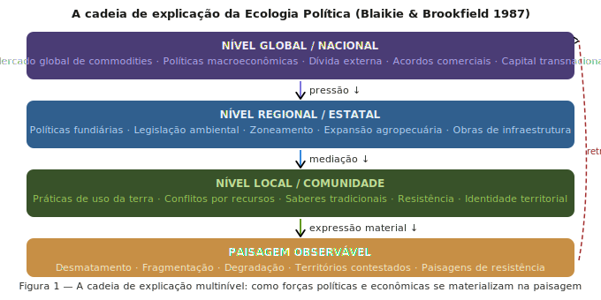
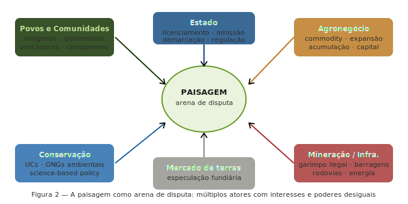
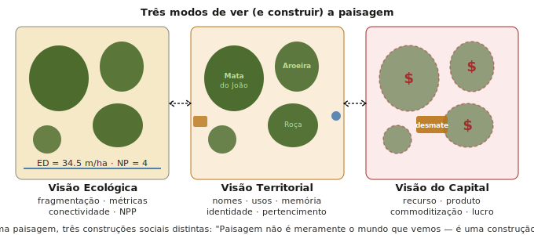
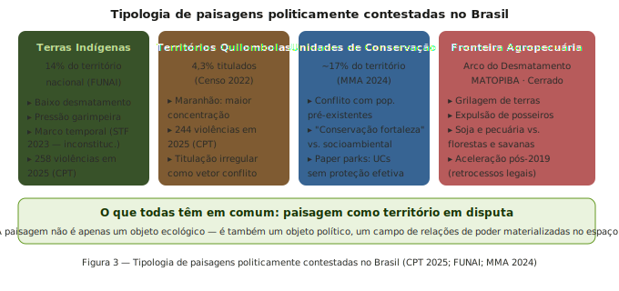
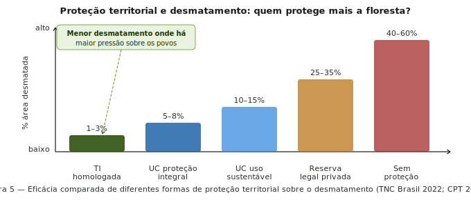

## O que a Ecologia de Paisagens não pergunta — mas deveria

- **Quem** decidiu que a paisagem seria configurada assim?
- **Em benefício de quem** opera esse arranjo espacial?
- **A que custo** — e para quem — foi produzida esta paisagem?
- **Quem foi excluído** para que esta paisagem existisse?

::: {.callout-note appearance="minimal"}
O mapa de fragmentação não é neutro. É o produto material de relações de poder.
:::

##

---

## O que é Ecologia Política?

Campo crítico e interdisciplinar que estuda a mudança ambiental e as lutas em torno dela, com foco em:

- **Poder** — quem controla os recursos e o espaço
- **Marginalização** — quem paga os custos da degradação
- **Conflito** — disputas sobre acesso, uso e significado do território
- **Construção social** — como o ambiente é *produzido* por relações sociais

>**Fundadores:** Blaikie, Brookfield (1987) · Peet & Watts (1996) · Robbins (2004)

---

## A cadeia de explicação

[**Blaikie & Brookfield (1987) — *Land Degradation and Society*:**](https://www.taylorfrancis.com/books/edit/10.4324/9781315685366/land-degradation-society-piers-blaikie-harold-brookfield)

Para entender a degradação ambiental, é preciso subir a cadeia de causas:

:::{.incremental}
- **Local:** o agricultor derruba a floresta
- **Regional:** políticas de crédito favorecem monocultura
- **Nacional:** reforma agrária bloqueada, grilagem tolerada
- **Global:** demanda por soja, carne e commodities
:::

> A paisagem que medimos **é** a sedimentação histórica dessas cadeias causais

## A paisagem como arena de poder 

:::{.incremental}
- **Agronegócio** — capital, tecnologia, lobbying legislativo
- **Estado** — regulação, licenciamento, omissão seletiva
- **Povos e comunidades** — direitos territoriais, saberes, resistência
- **Conservação** — ciência, ONGs, acordos internacionais
- **Mineração e infraestrutura** — licenças, financiamento público
- **Mercado de terras** — especulação fundiária, grilagem
:::
## A paisagem como arena de poder

## Paisagem como construção social

- **Ecólogo:** ED = 34 m/ha · NP = 4 · AI = 72
- **Comunidade quilombola:** "Mata do Zé Rodrigues, onde a família coleta cipó desde o avô do bisavô"
- **Agronegócio:** "Área de reserva legal a compensar"

**Implicação:**

Não é relativismo — as métricas são reais. É reconhecer que **sobre a mesma realidade biofísica operam múltiplas construções sociais** com consequências políticas distintas

## Paisagem como construção social

## Territórios em disputa no Brasil

:::{.incremental}
- **Terras Indígenas** — 14% do território; pressão garimpeira; violências 
- **Territórios Quilombolas** — 4,3% titulados (Censo 2022); violências
- **Unidades de Conservação** — ~17% do território; conflito com populações pré-existentes; *paper parks*
- **Fronteira Agropecuária** — MATOPIBA, Cerrado; grilagem; expulsão de posseiros; Arco do Desmatamento
:::

## Territórios em disputa no Brasil

## Terras Indígenas: poder e conservação

- TIs homologadas têm **menor taxa de desmatamento** que qualquer outra categoria de proteção
- Menor desmatamento ocorre onde há **maior pressão sobre os povos**
- Proteção florestal e direitos indígenas são **aliados estruturais**, não rivais

> Povos indígenas em TIs demarcadas protegem efetivamente ~1,1 milhão km² de floresta amazônica com custo fiscal muito inferior ao das UCs convencionais

## Terras Indígenas: poder e conservação

## Quilombolas e o neoextrativismo

- Comunidades no noroeste de MG, Maranhão e Bahia mantêm quintais agroflorestais com dezenas de espécies nativas
- Práticas de roça de coivara preservam mosaicos de vegetação em diferentes estágios sucessionais
- Resultam em paisagens com maior conectividade que áreas vizinhas privadas

## Quilombolas e o neoextrativismo

## Conservação fortaleza vs. socioambiental

:::: {.columns}

::: {.column width="48%"}

**"Fortress conservation" (conservação fortaleza):**

- Modelo que expulsa populações
- Herança colonial 
- Produz conflitos prolongados
:::
::: {.column width="48%"}

**A alternativa socioambiental:**

- Reservas Extrativistas (RESEX) 
- Áreas de Proteção Ambiental (APA)
- Gestão compartilhada com comunidades tradicionais
:::

::::

## Conservação convivial

<iframe width="1358" height="764" src="https://www.youtube.com/embed/fI_IYLHv96o" title="The Case for Convivial Conservation | Español" frameborder="0" allow="accelerometer; autoplay; clipboard-write; encrypted-media; gyroscope; picture-in-picture; web-share" referrerpolicy="strict-origin-when-cross-origin" allowfullscreen></iframe>

## Paisagens de resistência

- **Agroecologia / quintais:** alta diversidade, espécies nativas, soberania alimentar
- **Territórios quilombolas:** manejo florestal comunitário, roças de coivara, cipós, medicinais
- **RESEX:** seringueiros e castanheiros — floresta em pé como modelo econômico
- **Mapeamento participativo:** "o mapa como arma" contra-cartografia como instrumento legal

> Essas paisagens têm menor desmatamento, maior biodiversidade, maior conectividade e maior estoque de carbono — com menor custo social

## Paisagens de resistência

{fig-align=center}

---

## O ecólogo como ator político

**Ao publicar ciência, o ecólogo:**

- Produz dados que podem justificar expulsão de comunidades
- Ou produz dados que fundamentam a defesa de territórios
- A neutralidade não é uma opção real — é uma posição política disfarçada

## O ecólogo como ator político

**Pluralismo epistemológico:**

- O conhecimento ecológico tradicional contém informações que nenhuma série temporal de satélite captura
- Integrar saberes não é relativismo — é ampliar o campo do conhecimento válido
- A tendência de tratar conflitos como "problemas a resolver" é uma posição política
- Os conflitos **são** a estrutura de poder que produz a paisagem

## O ecólogo como ator político

## Nordeste e Caatinga: a Ecologia Política do semiárido

**A paisagem da Caatinga não é natural:**

- Séculos de latifúndio e concentração fundiária
- Comunidades manejam a Caatinga há gerações
- A paisagem é a materialização da estrutura agrária nordestina

## Nordeste e Caatinga: a Ecologia Política do semiárido

- Expansão da carcinicultura sobre manguezais e apicuns
- Energia solar e eólica sobre campos nativos — "transição energética" sobre territórios tradicionais
- Adutoras e transposição do São Francisco: disputas sobre água como paisagem
- Quilombos do semiárido: invisibilidade histórica e pressão fundiária crescente

## Nordeste e Caatinga: a Ecologia Política do semiárido

[Onças e eólicas](https://brasil.mongabay.com/2023/08/ultimas-oncas-da-caatinga-enfrentam-nova-ameaca-complexos-eolicos/)

## Síntese: cinco conclusões {.scrollable}

**1. Paisagens são resultado de relações de poder**
O padrão de fragmentação não é neutro — é o produto de decisões políticas e exclusões históricas

**2. Diferentes atores constroem a mesma paisagem de formas distintas**
Sobre o mesmo espaço biofísico operam visões ecológicas, territoriais e do capital radicalmente distintas

**3. Justiça territorial e conservação são aliadas**
TIs demarcadas: menor desmatamento, maior biodiversidade — e maior justiça social

**4. Paisagens de resistência têm boas métricas ecológicas**
Agroecologia, extrativismo e manejo comunitário produzem paisagens ecologicamente superiores às da monocultura

**5. A ecologia não é neutra**
A posição epistemológica importa — e a Ecologia Política convida à tomada de partido consciente e eticamente informada

## fim{.center}