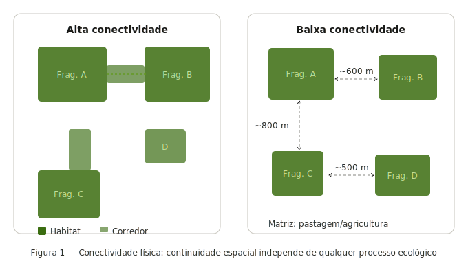
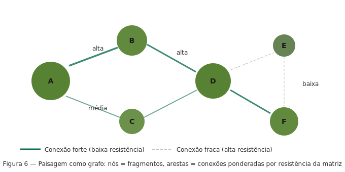
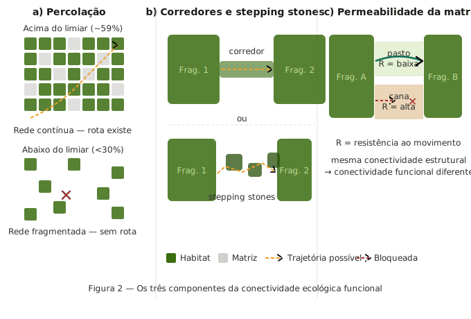
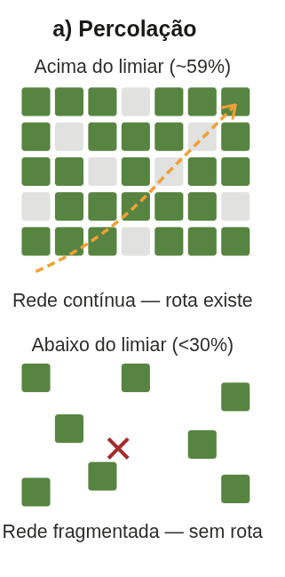
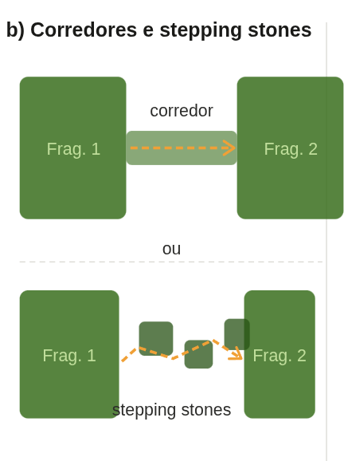
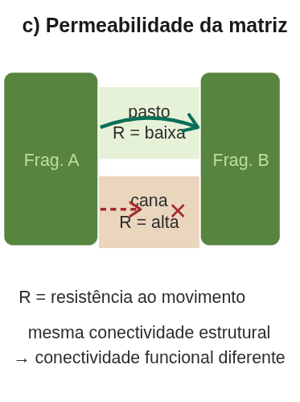
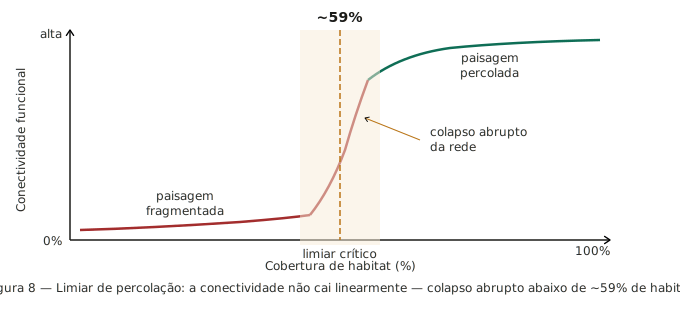
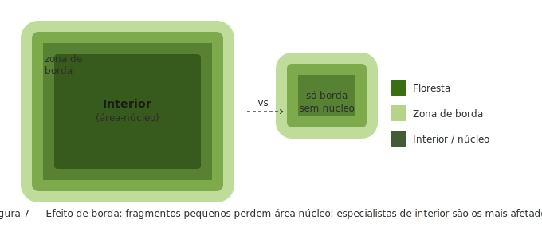
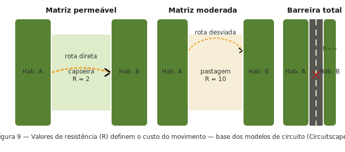
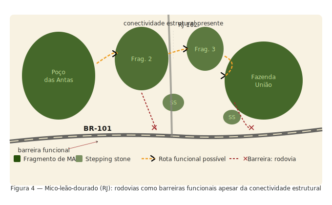

## O problema central

:::: {.columns}

::: {.column width="48%"}

- A mesma estrutura física pode ser:
  - Uma passagem funcional para uns
  - Uma barreira intransponível para outros
- A resposta depende **sempre da espécie**

:::

::: {.column width="48%"}

:::

::::

---

## O que é conectividade física?

:::: {.columns}

::: {.column width="48%"}

- Grau em que elementos da paisagem estão **fisicamente contíguos ou próximos**
- Mensurável 
  - Compartilham borda comum *(adjacência direta)*
  - Estão dentro de um limiar de distância

:::

::: {.column width="48%"}

:::

::::

---

## Métricas de conectividade física

:::: {.columns}

::: {.column width="48%"}

**Limitação fundamental:**

- Estas métricas são **espécie-cegas**
- Não informam se um corredor é **usado** pela fauna
- Necessário complementar com dados biológicos

:::

::: {.column width="4%"}
:::

::: {.column width="48%"}

:::

::::

---

## O que é conectividade ecológica?

:::: {.columns}

::: {.column width="48%"}

- Grau em que a paisagem **facilita ou impede o movimento** de organismo
- A mesma paisagem pode ser:
  - **Altamente conectada** para espécies generalistas
  - **Completamente isolante** para especialistas

:::

::: {.column width="4%"}
:::

::: {.column width="48%"}

:::

::::

---

## Os três componentes da conectividade funcional{.center}

## 1. Percolação do habitat 
:::: {.columns}

::: {.column}

- Existência de redes contínuas percorríveis
- Limiar crítico: **~59%** de cobertura de habitat
- Abaixo do limiar: colapso **abrupto** da rede

:::
::: {.column}

:::
:::

## 2. Corredores e stepping stones

:::: {.columns}

::: {.column}

- Corredores: estruturas lineares que ligam fragmentos
- *Stepping stones*: manchas pequenas como pontos de parada

:::
::: {.column}

:::
::::

## 3. Permeabilidade da matriz

:::: {.columns}

::: {.column}

- Diferentes usos do solo oferecem diferentes resistências
- Matriz de pasto ≠ matriz de cana ≠ rodovia
- Pode ser mais determinante que a presença de corredores

:::

::: {.column}

:::

::::

---

## A existência de limiares

:::: {.columns}

::: {.column width="48%"}

- Deriva da **quantidade de hábitat** 
- Abaixo deste certo valor há **colapso abrupto**
- A relação **não é linear** 
- Pequenas perdas adicionais podem romper redes inteiras

:::

::: {.column width="4%"}
:::

::: {.column width="48%"}

:::

::::

---

## Conectividade é espécie-específica

:::: {.columns}

::: {.column width="48%"}

- **Anfíbio terrestre**: estrada de terra = barreira
- **Garça**: mesma estrada = invisível
- **Sagui** (generalista): faixa de 30 m de mata ciliar
- **Gavião-real** (especialista): gargalo intransponível

- Não existe conectividade "da paisagem" em abstrato

:::

::: {.column width="4%"}
:::

::: {.column width="48%"}

:::

::::

---

## Permeabilidade da matriz

- Cada tipo de uso do solo tem um **valor de resistência (R)**
- Baixa resistência → organismos cruzam com facilidade e baixa mortalidade
- Alta resistência → poucos indivíduos cruzam; desvios longos necessários

## Exemplos de resistência relativa (mamíferos médio porte)

| Tipo de matriz | R aproximado |
|---|---|
| Capoeira/mata secundária | 1–3 |
| Pasto baixo | 5–10 |
| Agricultura extensiva | 20–50 |
| Rodovia movimentada | 500–∞ |

## Resistância da matriz

---

## Os quatro cenários possíveis

---

## Caatinga: corredor físico, barreira ecológica

:::: {.columns}

::: {.column width="48%"}

- Paisagens com fragmentos ligados por **mata ciliar de 30–50 m**
- Estruturalmente: conectividade física presente *(borda compartilhada)*
**Lição:** Medir só a estrutura leva a diagnósticos enganosos

:::

::: {.column width="4%"}
:::

::: {.column width="48%"}

:::

::::

---

## Caso 2 — Mico-leão-dourado e a BR-101

:::: {.columns}

::: {.column width="48%"}

:::

::: {.column width="4%"}
:::

::: {.column width="48%"}

:::

::::

---

## Ferramentas para medir conectividade funcional

:::: {.columns}

::: {.column width="48%"}

**Modelos de resistência e custo:**

- Telemetria (GPS/VHF) 
- Genética de paisagem 
- Câmeras-trap 
- Marcação e recaptura 
:::

::: {.column width="4%"}
:::

::: {.column width="48%"}

:::

::::

---

## Síntese: o que a análise de conectividade requer

1. **Para quem?** — definir espécie ou processo-alvo antes de qualquer métrica
2. **Em que escala?** — calibrar extensão e grão para a biologia da espécie
3. **Qual a resistência da matriz?** — não tratar a matriz como espaço vazio
4. **O corredor é usado?** — validar com dados biológicos independentes

---

## Finalmentes

→ **Conectividade física** pertence ao mapa — mensurável sem dados biológicos

→ **Conectividade funcional** pertence à espécie — emerge da interação organismo ↔ paisagem

→ A mesma paisagem pode ser conectada para uns e isolante para outros

→ A matriz importa: resistência diferencial define quem passa e quem não passa

→ Toda análise deve começar com a pergunta: **para qual espécie ou processo?**

---

## FIM{.center}
