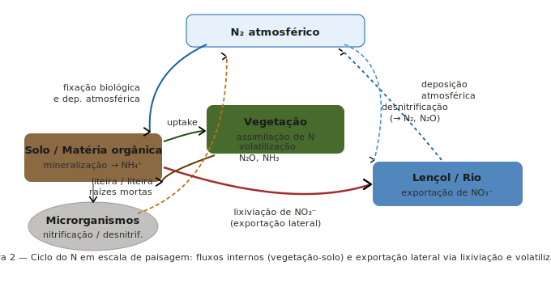

---

## Da estrutura para a função

**Onde estamos no curso:**

- **Semana 8: Função** — como energia e matéria se movem

**A pergunta central:**

- Como o **padrão espacial** do mosaico de paisagem controla os fluxos de energia e nutrientes?
- A mesma área de floresta tem impacto biogeoquímico diferente dependendo de **onde** está na paisagem


---

## Tipos de fluxo no mosaico

:::: {.columns}

::: {.column width="48%"}

**Três categorias de fluxo (Forman & Godron 1986):**

- **Energia:** 
- **Materiais:**
- **Organismos:** 

**O motor dos fluxos:** ->>> **Heterogeneidade espacial** 

:::

::: {.column width="4%"}
:::

::: {.column width="48%"}


:::

::::

---

## O ciclo do nitrogênio em paisagens

:::: {.columns}

::: {.column width="48%"}

**Por que o N é o nutriente-traçador da paisagem?**

- Altamente solúvel 
- Fixação → uptake vegetal → liteira → mineralização → nitrificação
- Lixiviação de NO₃⁻ 
- Volatilização (N₂O, NH₃) 
- Deposição atmosférica

:::

::: {.column width="4%"}
:::

::: {.column width="48%"}



:::

::::

---

## A abordagem de bacia hidrográfica

:::: {.columns}

::: {.column width="48%"}

**O experimento de Hubbard Brook:**

- **Entradas**: precipitação + deposição atmosférica
- **Saídas**: fluxo fluvial na foz
- **Balanço** = Entradas − Saídas = acúmulo ou perda de nutrientes

:::

::: {.column width="4%"}
:::

::: {.column width="48%"}


:::

::::

---

## O experimento de desmatamento

:::: {.columns}

::: {.column width="48%"}

- Desmatamento total + inibição da regeneração (1965–66)
- Aumento exportação de NO₃⁻ em **~40 vezes**
- Escoamento total aumentou **~4 vezes**
- Exportação de Ca²⁺ e K⁺ aumentou 


:::

::: {.column width="4%"}
:::

::: {.column width="48%"}


:::

::::

---

## APP ripária: suficiente para a biogeoquímica?


**Código Florestal Brasileiro (Lei 12.651/2012):**

- Rios &lt;10 m: APP mínima de **30 m**
- Rios 10–50 m: **50 m**
- Rios >600 m: **500 m**
- Legalmente adequado ≠ biogeoquimicamente adequado
- Ponto de debate científico e político central no Brasil


## Sequestro de carbono na paisagem

**C não depende só de quanto há de floresta — depende de onde:**

- Florestas sobre solos orgânicos profundos
- Fragmentação aumenta fluxos laterais de C orgânico 

## Uso do solo e fluxos biogeoquímicos

**Conversão floresta → agricultura altera:**

- **↑ Exportação de NO₃⁻:** sem demanda biológica perene, N lixivia para rios
- **↑ Erosão e exportação de P:** solo exposto + escoamento superficial aumentado
- **↓ Sequestro de C:** perda de biomassa + oxidação da MOS
- **Alteração hidrológica:** menos ET → mais escoamento → sazonalidade de fluxos de nutrientes alterada


## Medindo no R: métricas de borda e fluxo

**Métricas relevantes para fluxos biogeoquímicos:**

```r
calculate_lsm(paisagem, what = c(
  "lsm_l_ed",    # densidade de borda total
  "lsm_l_shdi",  # diversidade (heterogeneidade)
  "lsm_c_pland", # % área por classe (composição)
  "lsm_c_ed"     # borda por classe
))
```

**Interpretação biogeoquímica:**

- `ed` alta em classe agrícola → **↑ interface agrícola-floresta → ↑ risco de exportação de N**
- `shdi` alta → paisagem heterogênea → mais fluxos laterais entre patches
- `pland` de floresta ripária → **proxy de capacidade de tamponamento**

**Limitação:** métricas estruturais são proxies — fluxos reais exigem dados de qualidade de água ou tracers isotópicos


---

## Síntese: cinco lições


**1. Padrão espacial controla fluxos**
- Mesma área de floresta, impacto biogeoquímico diferente dependendo de *onde* está

**2. Fronteiras são zonas ativas**
- Bordas entre patches: alta desnitrificação, decomposição acelerada, gradientes biogeoquímicos intensos

**3. Ecossistemas são abertos e interdependentes**
- Rios dependem de florestas ripárias; florestas ripárias dependem do subsidio hídrico; ambos dependem da integridade da bacia

**4. Vegetação = regulador de retenção**
- Hubbard Brook: remoção da vegetação colapsa retenção de N (×40 de exportação)

**5. Qualidade da água = integrador da paisagem**
- Estado do rio reflete composição e configuração de toda a bacia a montante

